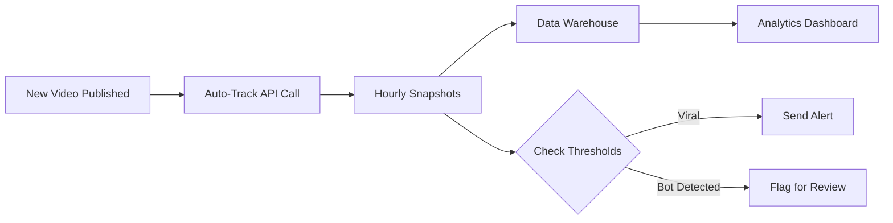

Build automated systems that continuously track and analyze social media performance across all platforms. This guide shows you how to set up workflows that run without manual intervention.

## Why Automate?

Manual tracking is time-consuming and prone to delays. Automation ensures:

- **Consistent Monitoring**: Never miss important performance changes
- **Timely Alerts**: Get notified when videos go viral
- **Scalability**: Track hundreds of videos simultaneously
- **Data Integration**: Feed analytics into your existing systems

## Automation Workflows

### 1. Automated Video Discovery

Track new content automatically as it's published:

```javascript
// Example: Monitor a TikTok creator's new videos
const checkNewVideos = async (username) => {
  // Get creator's latest videos from their profile
  const latestVideos = await fetchCreatorVideos(username);
  
  // Track any new videos not in your database
  for (const video of latestVideos) {
    if (!isAlreadyTracked(video.id)) {
      await fetch('https://contentstats.io/api/v1/videos/track', {
        method: 'POST',
        headers: {
          'Content-Type': 'application/json',
          'X-API-Key': process.env.CONTENTSTATS_API_KEY
        },
        body: JSON.stringify({
          video_link: video.url,
          duration_days: 7
        })
      });
    }
  }
};

// Run every hour
setInterval(checkNewVideos, 60 * 60 * 1000);
```

### 2. Scheduled Reporting

Generate and send reports automatically:

```python
import schedule
import time
from datetime import datetime
import requests

def generate_weekly_report():
    # Fetch all tracked videos
    response = requests.get(
        'https://contentstats.io/api/v1/videos',
        headers={'X-API-Key': 'cs_live_YOUR_KEY'}
    )
    
    videos = response.json()['videos']
    
    # Calculate metrics
    total_views = sum(v['latest_snapshot']['views'] for v in videos)
    top_performer = max(videos, key=lambda v: v['latest_snapshot']['views'])
    
    # Send report (email, Slack, etc.)
    send_report({
        'period': 'Weekly',
        'total_views': total_views,
        'top_video': top_performer['video_link'],
        'date': datetime.now().isoformat()
    })

# Schedule weekly reports
schedule.every().monday.at("09:00").do(generate_weekly_report)

while True:
    schedule.run_pending()
    time.sleep(60)
```

### 3. Real-Time Alerts

Get notified when performance thresholds are met:

```javascript
const checkViralThreshold = async (videoId) => {
  const response = await fetch(
    `https://contentstats.io/api/v1/videos/${videoId}`,
    {
      headers: { 'X-API-Key': process.env.CONTENTSTATS_API_KEY }
    }
  );
  
  const video = await response.json();
  const snapshots = video.snapshots;
  
  if (snapshots.length < 2) return;
  
  // Check for viral growth (10x views in 24 hours)
  const latest = snapshots[snapshots.length - 1];
  const previous = snapshots[snapshots.length - 24]; // 24 hours ago
  
  if (latest.views > previous.views * 10) {
    await sendAlert({
      type: 'viral',
      video: video.video_link,
      views: latest.views,
      growth: ((latest.views / previous.views - 1) * 100).toFixed(1) + '%'
    });
  }
};
```

## Popular Automation Tools

### Zapier Integration

Use Webhooks to connect ContentStats.io with 5,000+ apps:

1. Set up a webhook in your ContentStats.io dashboard
2. Configure Zapier to receive webhook events
3. Create workflows (Zaps):
   - Video goes viral → Send Slack notification
   - New high-performing video → Add to spreadsheet
   - Bot detected → Send email alert

### Make (Integromat)

Build complex automation scenarios:

```javascript
// Example: Multi-step workflow
1. Schedule: Every 6 hours
2. HTTP Request: Get all tracked videos
3. Filter: Videos with >100k views
4. Iterator: Loop through filtered videos
5. HTTP Request: Get bot analysis for each
6. Filter: Bot confidence score < 70%
7. Action: Send notification to Slack
```

### Custom Scripts (Cron Jobs)

Run scheduled tasks on your server:

```bash
# crontab -e

# Check for viral videos every hour
0 * * * * /usr/bin/node /path/to/check-viral.js

# Generate daily report at 8 AM
0 8 * * * /usr/bin/python /path/to/daily-report.py

# Clean up old tracking jobs weekly
0 0 * * 0 /usr/bin/node /path/to/cleanup.js
```

## Automated Data Pipeline

Build a complete analytics pipeline:



### Example: ETL Pipeline

```python
import requests
import psycopg2
from datetime import datetime

class ContentStatsETL:
    def __init__(self, api_key, db_conn):
        self.api_key = api_key
        self.db = db_conn
    
    def extract(self):
        """Fetch data from ContentStats.io API"""
        response = requests.get(
            'https://contentstats.io/api/v1/videos',
            headers={'X-API-Key': self.api_key}
        )
        return response.json()['videos']
    
    def transform(self, videos):
        """Clean and structure data"""
        transformed = []
        for video in videos:
            snapshot = video['latest_snapshot']
            transformed.append({
                'video_id': video['id'],
                'platform': video['platform'],
                'views': snapshot['views'],
                'likes': snapshot['likes'],
                'engagement_rate': snapshot['likes'] / snapshot['views'] * 100,
                'bot_score': video['bot_analysis']['overall_confidence'],
                'timestamp': snapshot['created_at']
            })
        return transformed
    
    def load(self, data):
        """Insert into database"""
        cursor = self.db.cursor()
        for row in data:
            cursor.execute("""
                INSERT INTO video_analytics 
                (video_id, platform, views, likes, engagement_rate, bot_score, timestamp)
                VALUES (%s, %s, %s, %s, %s, %s, %s)
                ON CONFLICT (video_id, timestamp) DO UPDATE SET
                views = EXCLUDED.views,
                likes = EXCLUDED.likes,
                engagement_rate = EXCLUDED.engagement_rate,
                bot_score = EXCLUDED.bot_score
            """, tuple(row.values()))
        self.db.commit()
    
    def run(self):
        videos = self.extract()
        transformed = self.transform(videos)
        self.load(transformed)
        print(f"Loaded {len(transformed)} records at {datetime.now()}")

# Run every hour
etl = ContentStatsETL('cs_live_YOUR_KEY', db_connection)
etl.run()
```

## Best Practices

<AccordionGroup>
  <Accordion icon="clock" title="Optimize API Calls">
    - Cache responses when appropriate
    - Batch operations instead of individual requests
    - Use webhooks instead of polling when possible
    - Respect rate limits (see [Rate Limits](/api-reference/rate-limits))
  </Accordion>

  <Accordion icon="database" title="Data Storage">
    - Store historical snapshots in your own database
    - Implement data retention policies
    - Create backups of critical tracking data
    - Index frequently queried fields
  </Accordion>

  <Accordion icon="bell" title="Smart Alerting">
    - Set meaningful thresholds to avoid alert fatigue
    - Group related alerts to reduce noise
    - Include context in notifications (links, metrics)
    - Test alert delivery regularly
  </Accordion>

  <Accordion icon="shield-check" title="Error Handling">
    - Implement retry logic with exponential backoff
    - Log all API errors for debugging
    - Set up monitoring for your automation scripts
    - Have fallback mechanisms for critical workflows
  </Accordion>
</AccordionGroup>

## Example: Complete Automation System

Here's a production-ready example combining multiple automation techniques:

```javascript
const express = require('express');
const schedule = require('node-schedule');

class SocialMediaAutomation {
  constructor(apiKey) {
    this.apiKey = apiKey;
    this.baseUrl = 'https://contentstats.io/api/v1';
  }

  // Auto-track new videos from a list of creators
  async trackNewContent(creators) {
    for (const creator of creators) {
      const newVideos = await this.findNewVideos(creator);
      
      for (const video of newVideos) {
        await this.trackVideo(video.url, 7);
        console.log(`Started tracking: ${video.url}`);
      }
    }
  }

  // Monitor all videos and send alerts
  async monitorPerformance() {
    const videos = await this.getAllVideos();
    
    for (const video of videos) {
      // Check for viral growth
      if (this.isGoingViral(video)) {
        await this.sendAlert('viral', video);
      }
      
      // Check for bot activity
      if (video.bot_analysis.overall_confidence < 70) {
        await this.sendAlert('bot_detected', video);
      }
    }
  }

  // Generate and email daily reports
  async generateDailyReport() {
    const videos = await this.getAllVideos();
    const report = this.createReport(videos);
    await this.emailReport(report);
  }

  // Start all scheduled jobs
  start() {
    // Track new content every 2 hours
    schedule.scheduleJob('0 */2 * * *', () => {
      this.trackNewContent(this.creators);
    });

    // Monitor performance every hour
    schedule.scheduleJob('0 * * * *', () => {
      this.monitorPerformance();
    });

    // Daily report at 9 AM
    schedule.scheduleJob('0 9 * * *', () => {
      this.generateDailyReport();
    });

    console.log('Automation system started');
  }

  async trackVideo(url, days) {
    return fetch(`${this.baseUrl}/videos/track`, {
      method: 'POST',
      headers: {
        'Content-Type': 'application/json',
        'X-API-Key': this.apiKey
      },
      body: JSON.stringify({
        video_link: url,
        duration_days: days
      })
    }).then(r => r.json());
  }

  async getAllVideos() {
    return fetch(`${this.baseUrl}/videos`, {
      headers: { 'X-API-Key': this.apiKey }
    }).then(r => r.json()).then(d => d.videos);
  }
}

// Initialize and start
const automation = new SocialMediaAutomation(process.env.CONTENTSTATS_API_KEY);
automation.start();
```

## Next Steps

<CardGroup cols={2}>
  <Card
    title="Real-Time Analytics"
    icon="gauge"
    href="/guides/general/real-time-analytics"
  >
    Build live monitoring dashboards
  </Card>
  <Card
    title="API Reference"
    icon="code"
    href="/api-reference/introduction"
  >
    Complete API documentation
  </Card>
  <Card
    title="Hourly Tracking"
    icon="clock"
    href="/guides/general/hourly-tracking"
  >
    Understand hourly snapshot collection
  </Card>
  <Card
    title="Rate Limits"
    icon="shield"
    href="/api-reference/rate-limits"
  >
    API rate limits and best practices
  </Card>
</CardGroup>

<Note>
  **Need help?** Contact [support](/support) for assistance with automation setup.
</Note>
