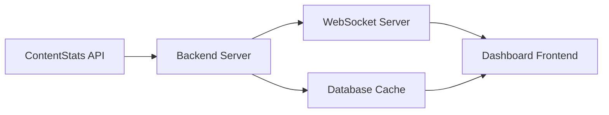

Build live monitoring dashboards that display social media performance in real-time using ContentStats.io's hourly snapshot data. Perfect for tracking viral content, campaigns, and competitive analysis.

## Why Real-Time Monitoring?

Traditional analytics have delays of 24-48 hours. Real-time dashboards give you:

- **Instant Insights**: See performance changes as they happen
- **Early Detection**: Catch viral content in the first hours
- **Quick Response**: React to trends before they peak
- **Live Tracking**: Monitor campaigns and influencer content in real-time

## Dashboard Architecture



## Quick Start: Simple Dashboard

Build a basic real-time dashboard in under 30 minutes:

### 1. Backend API Endpoint

```javascript
// server.js
const express = require('express');
const fetch = require('node-fetch');

const app = express();
const CONTENTSTATS_API_KEY = process.env.CONTENTSTATS_API_KEY;

// Cache layer to reduce API calls
let cache = {
  data: null,
  timestamp: null
};

app.get('/api/dashboard', async (req, res) => {
  // Return cached data if less than 5 minutes old
  if (cache.data && Date.now() - cache.timestamp < 5 * 60 * 1000) {
    return res.json(cache.data);
  }

  try {
    // Fetch all tracked videos
    const response = await fetch('https://contentstats.io/api/v1/videos', {
      headers: { 'X-API-Key': CONTENTSTATS_API_KEY }
    });

    const data = await response.json();
    
    // Transform for dashboard
    const dashboardData = {
      videos: data.videos.map(v => ({
        id: v.id,
        platform: v.platform,
        url: v.video_link,
        views: v.latest_snapshot.views,
        likes: v.latest_snapshot.likes,
        comments: v.latest_snapshot.comments,
        engagement_rate: (v.latest_snapshot.likes / v.latest_snapshot.views * 100).toFixed(2),
        bot_score: v.bot_analysis.overall_confidence,
        updated_at: v.latest_snapshot.created_at
      })),
      summary: {
        total_videos: data.videos.length,
        total_views: data.videos.reduce((sum, v) => sum + v.latest_snapshot.views, 0),
        avg_engagement: calculateAvgEngagement(data.videos)
      }
    };

    // Update cache
    cache = {
      data: dashboardData,
      timestamp: Date.now()
    };

    res.json(dashboardData);
  } catch (error) {
    res.status(500).json({ error: error.message });
  }
});

app.listen(3000, () => console.log('Dashboard API running on port 3000'));
```

### 2. Frontend Dashboard

```html
<!DOCTYPE html>
<html>
<head>
  <title>Social Media Dashboard</title>
  <script src="https://cdn.jsdelivr.net/npm/chart.js"></script>
  <style>
    body { font-family: system-ui; padding: 20px; background: #0a0a0a; color: #fff; }
    .stats { display: grid; grid-template-columns: repeat(auto-fit, minmax(250px, 1fr)); gap: 20px; margin-bottom: 30px; }
    .stat-card { background: #1a1a1a; padding: 20px; border-radius: 8px; border: 1px solid #333; }
    .stat-value { font-size: 2em; font-weight: bold; color: #6798ff; }
    .stat-label { color: #999; margin-top: 5px; }
    .video-list { background: #1a1a1a; padding: 20px; border-radius: 8px; }
    .video-item { padding: 15px; border-bottom: 1px solid #333; display: flex; justify-content: space-between; }
    .metric { display: inline-block; margin-right: 20px; }
    .bot-warning { color: #ff6b6b; }
  </style>
</head>
<body>
  <h1>📊 Real-Time Social Media Dashboard</h1>
  
  <div class="stats">
    <div class="stat-card">
      <div class="stat-value" id="total-views">-</div>
      <div class="stat-label">Total Views</div>
    </div>
    <div class="stat-card">
      <div class="stat-value" id="total-videos">-</div>
      <div class="stat-label">Tracked Videos</div>
    </div>
    <div class="stat-card">
      <div class="stat-value" id="avg-engagement">-</div>
      <div class="stat-label">Avg Engagement Rate</div>
    </div>
  </div>

  <div class="video-list">
    <h2>Live Video Performance</h2>
    <div id="videos"></div>
  </div>

  <script>
    async function updateDashboard() {
      try {
        const response = await fetch('/api/dashboard');
        const data = await response.json();

        // Update summary stats
        document.getElementById('total-views').textContent = 
          data.summary.total_views.toLocaleString();
        document.getElementById('total-videos').textContent = 
          data.summary.total_videos;
        document.getElementById('avg-engagement').textContent = 
          data.summary.avg_engagement.toFixed(2) + '%';

        // Update video list
        const videosHtml = data.videos.map(v => `
          <div class="video-item">
            <div>
              <strong>${v.platform.toUpperCase()}</strong>
              ${v.bot_score < 70 ? '<span class="bot-warning">⚠️ Bot Activity</span>' : ''}
            </div>
            <div>
              <span class="metric">👁️ ${v.views.toLocaleString()}</span>
              <span class="metric">❤️ ${v.likes.toLocaleString()}</span>
              <span class="metric">💬 ${v.comments.toLocaleString()}</span>
              <span class="metric">📊 ${v.engagement_rate}%</span>
            </div>
          </div>
        `).join('');

        document.getElementById('videos').innerHTML = videosHtml;

        // Update timestamp
        console.log('Dashboard updated:', new Date().toLocaleTimeString());
      } catch (error) {
        console.error('Failed to update dashboard:', error);
      }
    }

    // Update every 5 minutes
    updateDashboard();
    setInterval(updateDashboard, 5 * 60 * 1000);
  </script>
</body>
</html>
```

## Advanced: Real-Time WebSocket Dashboard

For truly live updates, implement WebSocket connections:

### Backend with WebSockets

```javascript
const WebSocket = require('ws');
const express = require('express');
const http = require('http');

const app = express();
const server = http.createServer(app);
const wss = new WebSocket.Server({ server });

// Store connected clients
const clients = new Set();

wss.on('connection', (ws) => {
  clients.add(ws);
  console.log('Client connected. Total clients:', clients.size);

  ws.on('close', () => {
    clients.delete(ws);
    console.log('Client disconnected. Total clients:', clients.size);
  });
});

// Broadcast updates to all clients
function broadcastUpdate(data) {
  const message = JSON.stringify(data);
  clients.forEach(client => {
    if (client.readyState === WebSocket.OPEN) {
      client.send(message);
    }
  });
}

// Poll ContentStats API and broadcast changes
async function pollAndBroadcast() {
  try {
    const response = await fetch('https://contentstats.io/api/v1/videos', {
      headers: { 'X-API-Key': process.env.CONTENTSTATS_API_KEY }
    });

    const data = await response.json();
    broadcastUpdate({
      type: 'update',
      timestamp: new Date().toISOString(),
      data: transformData(data)
    });
  } catch (error) {
    console.error('Polling error:', error);
  }
}

// Poll every 5 minutes
setInterval(pollAndBroadcast, 5 * 60 * 1000);

server.listen(3000, () => console.log('WebSocket server running on port 3000'));
```

### Frontend with Live Updates

```javascript
// Connect to WebSocket
const ws = new WebSocket('ws://localhost:3000');

ws.onmessage = (event) => {
  const update = JSON.parse(event.data);
  
  if (update.type === 'update') {
    updateDashboard(update.data);
    showNotification('Dashboard updated with latest data');
  }
};

ws.onerror = (error) => {
  console.error('WebSocket error:', error);
  showError('Connection lost. Retrying...');
};

function updateDashboard(data) {
  // Animate changes
  animateStatChange('total-views', data.summary.total_views);
  animateStatChange('total-videos', data.summary.total_videos);
  
  // Update charts
  updateCharts(data);
  
  // Highlight new viral videos
  highlightViralContent(data.videos);
}
```

## Dashboard Metrics

### Key Performance Indicators

Display these critical metrics on your dashboard:

**Overview Metrics:**
- Total tracked videos
- Combined views across all platforms
- Average engagement rate
- Bot detection alerts

**Per-Video Metrics:**
- Views, Likes, Comments, Shares
- Engagement rate (likes/views)
- Growth rate (last hour vs previous hour)
- Bot confidence score
- Platform-specific metrics

**Trend Analysis:**
- Hourly growth velocity
- Peak engagement times
- Platform comparison
- Viral detection alerts

### Example: Metrics Calculation

```javascript
function calculateMetrics(video) {
  const snapshots = video.snapshots;
  const latest = snapshots[snapshots.length - 1];
  const previous = snapshots[snapshots.length - 2];

  return {
    // Current stats
    current: {
      views: latest.views,
      likes: latest.likes,
      comments: latest.comments,
      engagement_rate: (latest.likes / latest.views * 100).toFixed(2)
    },

    // Hourly growth
    hourly_growth: previous ? {
      views: latest.views - previous.views,
      likes: latest.likes - previous.likes,
      comments: latest.comments - previous.comments,
      percentage: ((latest.views / previous.views - 1) * 100).toFixed(2)
    } : null,

    // Velocity (views per hour)
    velocity: calculateVelocity(snapshots),

    // Bot analysis
    bot_risk: video.bot_analysis.overall_confidence < 70 ? 'high' : 'low',

    // Viral score (custom algorithm)
    viral_score: calculateViralScore(snapshots)
  };
}

function calculateVelocity(snapshots) {
  if (snapshots.length < 2) return 0;
  
  const latest = snapshots[snapshots.length - 1];
  const oldest = snapshots[0];
  
  const hoursDiff = (new Date(latest.created_at) - new Date(oldest.created_at)) / (1000 * 60 * 60);
  const viewsDiff = latest.views - oldest.views;
  
  return Math.round(viewsDiff / hoursDiff);
}
```

## Visualization Examples

### Charts.js Integration

```javascript
// Views over time chart
const ctx = document.getElementById('viewsChart').getContext('2d');
const viewsChart = new Chart(ctx, {
  type: 'line',
  data: {
    labels: snapshots.map(s => new Date(s.created_at).toLocaleTimeString()),
    datasets: [{
      label: 'Views',
      data: snapshots.map(s => s.views),
      borderColor: '#6798ff',
      tension: 0.4
    }]
  },
  options: {
    responsive: true,
    plugins: {
      legend: { display: false }
    },
    scales: {
      y: { beginAtZero: true }
    }
  }
});

// Platform comparison
const platformChart = new Chart(platformCtx, {
  type: 'bar',
  data: {
    labels: ['TikTok', 'YouTube', 'Instagram'],
    datasets: [{
      label: 'Total Views',
      data: [tiktokViews, youtubeViews, instagramViews],
      backgroundColor: ['#000000', '#FF0000', '#E4405F']
    }]
  }
});
```

## Production Considerations

<AccordionGroup>
  <Accordion icon="database" title="Caching Strategy">
    - Cache API responses for 5-10 minutes
    - Use Redis for multi-server deployments
    - Implement cache invalidation on data changes
    - Store historical data in your database
  </Accordion>

  <Accordion icon="zap" title="Performance Optimization">
    - Lazy load video details on demand
    - Paginate large video lists
    - Use virtual scrolling for 100+ videos
    - Compress WebSocket messages
  </Accordion>

  <Accordion icon="bell" title="Real-Time Alerts">
    - Browser notifications for viral content
    - Email alerts for bot detection
    - Slack integration for team updates
    - Custom webhook triggers
  </Accordion>

  <Accordion icon="mobile" title="Mobile Responsiveness">
    - Design mobile-first layouts
    - Touch-friendly controls
    - Reduced data for mobile clients
    - PWA support for offline access
  </Accordion>
</AccordionGroup>

## Dashboard Templates

Popular dashboard frameworks you can use:

### React Dashboard

```jsx
import React, { useState, useEffect } from 'react';

function Dashboard() {
  const [metrics, setMetrics] = useState(null);

  useEffect(() => {
    const fetchData = async () => {
      const response = await fetch('/api/dashboard');
      const data = await response.json();
      setMetrics(data);
    };

    fetchData();
    const interval = setInterval(fetchData, 5 * 60 * 1000);
    return () => clearInterval(interval);
  }, []);

  if (!metrics) return <div>Loading...</div>;

  return (
    <div className="dashboard">
      <StatsOverview summary={metrics.summary} />
      <VideoGrid videos={metrics.videos} />
      <PerformanceCharts videos={metrics.videos} />
    </div>
  );
}
```

### Next.js with Auto-Refresh

```jsx
// pages/dashboard.js
import useSWR from 'swr';

export default function Dashboard() {
  const { data, error } = useSWR('/api/dashboard', {
    refreshInterval: 5 * 60 * 1000 // Auto-refresh every 5 minutes
  });

  if (error) return <div>Failed to load</div>;
  if (!data) return <div>Loading...</div>;

  return <DashboardView data={data} />;
}
```

## Next Steps

<CardGroup cols={2}>
  <Card
    title="Automate Analytics"
    icon="robot"
    href="/guides/general/automate-analytics"
  >
    Build automated tracking systems
  </Card>
  <Card
    title="Hourly Tracking"
    icon="clock"
    href="/guides/general/hourly-tracking"
  >
    Understand hourly data collection
  </Card>
  <Card
    title="API Reference"
    icon="code"
    href="/api-reference/introduction"
  >
    Complete API documentation
  </Card>
  <Card
    title="Video Performance Tracking"
    icon="chart-line"
    href="/guides/general/video-performance-tracking"
  >
    Track and analyze video performance
  </Card>
</CardGroup>

<Note>
  **Want a custom dashboard?** Our team can help build enterprise dashboards. [Contact sales](https://contentstats.io/contact).
</Note>
